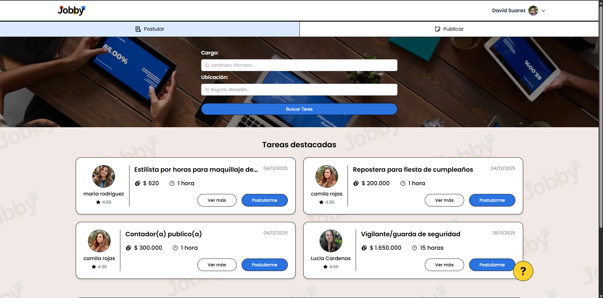
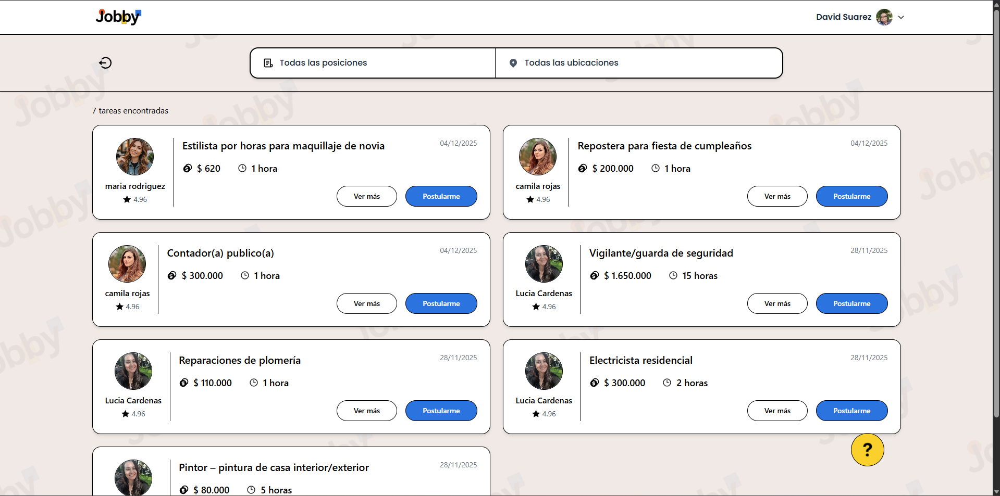
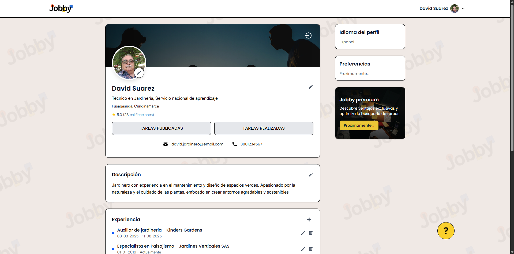
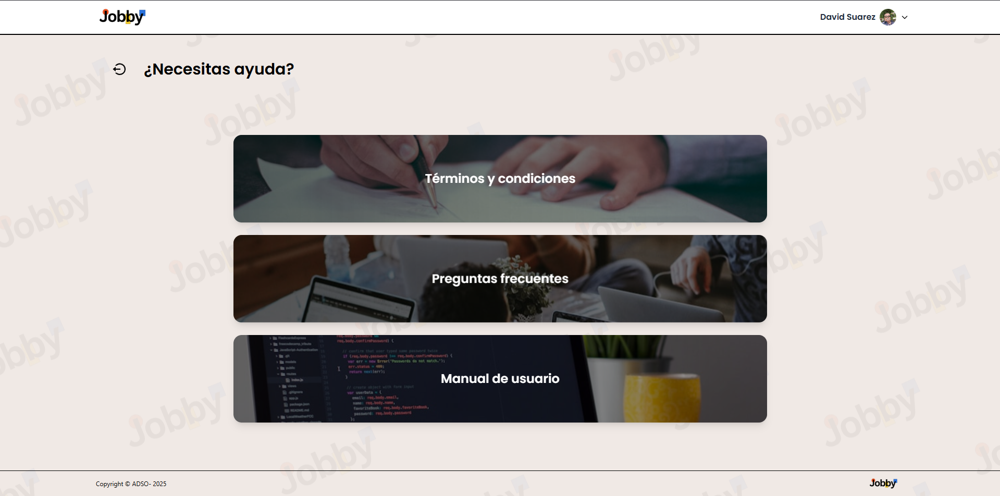

<div align="center">
  
  
  **Conectando oportunidades laborales**
  
  [](https://angular.io/)
  [](https://nodejs.org/)
  [](https://www.typescriptlang.org/)
  [](https://tailwindcss.com/)
  
</div>

---

## Descripción

Jobby es una plataforma web moderna que conecta a trabajadores independientes con clientes que necesitan servicios. La aplicación permite publicar tareas, aplicar a trabajos, gestionar perfiles de usuario y administrar proyectos de manera eficiente.

### Características principales

- **Autenticación segura** con JWT y bcrypt
- **Perfiles de usuario** personalizables con foto
- **Publicación de tareas** con detalles completos
- **Sistema de aplicaciones** a trabajos publicados
- **Notificaciones por email** con Nodemailer
- **Almacenamiento de imágenes** con Supabase
- **Búsqueda y filtrado** de tareas
- **Diseño responsive** con TailwindCSS

---

## 📸 Screenshots

<div align="center">
  <table>
    <tr>
      <td width="50%">
        
      </td>
      <td width="50%">
        
      </td>
    </tr>
    <tr>
      <td width="50%">
        
      </td>
      <td width="50%">
        
      </td>
    </tr>
  </table>
</div>

---

## Tecnologías

### Frontend
- **Framework:** Angular 20
- **Lenguaje:** TypeScript 5.8
- **Estilos:** TailwindCSS 4.1
- **HTTP Client:** Angular HttpClient
- **Routing:** Angular Router
- **SSR:** Angular Universal

### Backend
- **Runtime:** Node.js con Express 5.1
- **Lenguaje:** TypeScript 5.8
- **Base de Datos:** MySQL 2
- **Autenticación:** JWT + bcrypt
- **Validación:** express-validator
- **Seguridad:** Helmet, CORS
- **Email:** Nodemailer
- **Storage:** Supabase
- **File Upload:** Multer

---

## Instalación

### Requisitos previos

- Node.js (v18 o superior)
- MySQL (v8 o superior)
- npm o bun (gestor de paquetes)

### Clonar el repositorio

```bash
git clone https://github.com/tu-usuario/jobby.git
cd jobby
```

### Configurar el Servidor

```bash
cd server
npm install
```

Crea un archivo `.env` basado en `.env.example`:

```env
PORT=3002

# Database
DB_HOST=localhost
DB_NAME=jobby_db
DB_USER=tu_usuario
DB_PASSWORD=tu_contraseña
DB_PORT=3306

JWT_SECRET=tu_clave_secreta

SERVER_PROD=false

# CORS Configuration
FRONTEND_URL=http://localhost:4200
CORS_ORIGINS=http://localhost:4200

# Mail
SMTP_HOST=smtp.gmail.com
SMTP_PORT=465
SMTP_SECURE=true
SMTP_USER=tu_email@gmail.com
SMTP_PASS=tu_app_password
FROM_NAME=Jobby Support
FROM_EMAIL=tu_email@gmail.com

# Supabase
SUPABASE_KEY=tu_supabase_key
SUPABASE_URL=https://tu-proyecto.supabase.co
```

Inicia el servidor:

```bash
npm run dev
```

### Configurar el Cliente

```bash
cd ../client
npm install
```

Configura las variables de entorno en `src/environments/`:

- `environment.development.ts` para desarrollo
- `environment.ts` para producción

Inicia la aplicación:

```bash
npm start
```

La aplicación estará disponible en `http://localhost:4200`

---

## Estructura del proyecto

```
Jobby/
├── client/                 # Frontend Angular
│   ├── src/
│   │   ├── app/
│   │   │   ├── core/      # Guards, interceptors, servicios
│   │   │   ├── features/  # Módulos funcionales
│   │   │   └── shared/    # Componentes compartidos
│   │   └── environments/  # Variables de entorno
│   └── public/            # Recursos estáticos
│
└── server/                # Backend Node.js
    └── src/
        ├── config/        # Configuraciones
        ├── controllers/   # Controladores
        ├── interfaces/    # Interfaces TypeScript
        ├── middlewares/   # Middlewares
        ├── models/        # Modelos de datos
        ├── routes/        # Rutas API
        └── utils/         # Utilidades
```

---

## API endpoints

### Autenticación
- `POST /api/v1/register` - Registrar usuario
- `POST /api/v1/login` - Iniciar sesión
- `POST /api/v1/logout` - Cerrar sesión
- `POST /api/v1/request-password-reset` - Solicitar recuperación
- `POST /api/v1/reset-password` - Restablecer contraseña

### Usuarios
- `GET /api/v1/user/:id` - Obtener perfil de usuario
- `PUT /api/v1/user` - Actualizar perfil
- `PUT /api/v1/user/photo` - Actualizar foto de perfil

### Tareas
- `GET /api/v1/tasks` - Listar tareas
- `GET /api/v1/task/:id` - Obtener tarea específica
- `POST /api/v1/task` - Crear nueva tarea
- `PUT /api/v1/task/:id` - Actualizar tarea
- `DELETE /api/v1/task/:id` - Eliminar tarea
- `POST /api/v1/task/:id/apply` - Aplicar a una tarea
- `GET /api/v1/my-tasks` - Tareas del usuario
- `GET /api/v1/applied-tasks` - Tareas aplicadas

---

## Recursos

### Documentación

- [Manual Técnico](https://technical-jobby.netlify.app/) - Documentación técnica completa del proyecto
- [Manual de Usuario](https://jobby-manual.netlify.app/) - Guía de uso de la plataforma
- [API Documentation](https://documenter.getpostman.com/view/46794427/2sB34iieCp) - Documentación de la API REST

---

## Contribuciones

Las contribuciones son bienvenidas. Por favor, sigue estos pasos:

1. Fork el proyecto
2. Crea una rama para tu feature (`git checkout -b feature/AmazingFeature`)
3. Commit tus cambios (`git commit -m 'Add some AmazingFeature'`)
4. Push a la rama (`git push origin feature/AmazingFeature`)
5. Abre un Pull Request

---

## Licencia

Este proyecto está bajo la Licencia ISC.

---

<div align="center">
  <sub>Built with Angular, Node.js & TypeScript</sub>
</div>